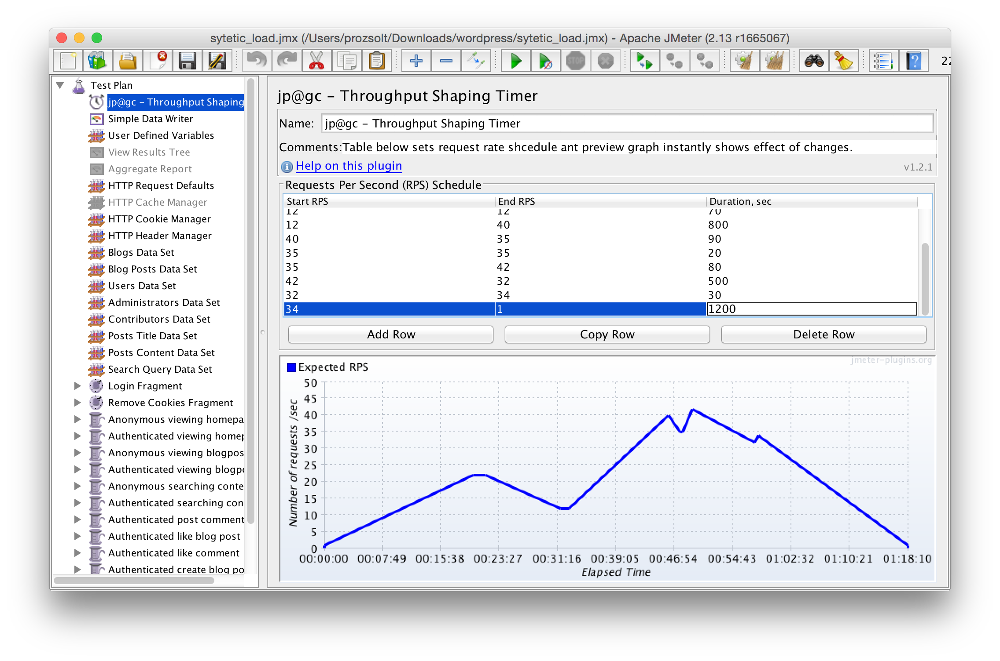

#Skálázó

Ez a része a programomnak teljesen moduláris, mivel lényege, hogy minél több skálázisi algoritmust egyszerűen ki lehessen próbálni.

##Általános felépítése
A skálázáshoz szükséges metrikákat a Graphite HTTP API-ján keresztül kérjük le.[@GraphiteAPI] Az API az eredményeket JSON formátumban adja vissza. Erre épülve készítettem egy Monitor osztályt, mely a lekérdezéseket kényelmesebbé teszi úgy, hogy könnyen paraméterezhetőek a függvényei és a  metrikákat egy könnyen használható struktúban adja vissza.

A skálázási algoritmus végeredményét, hogy kell-e ki- vagy beskálázni az Erőforrás Controller megfelelő függvényeinek hivogatásával jutathatjuk érvényre.

##Automatikus skálázási algoritmusok
Kiválasztottam egy reaktív és egy prediktív algoritmust, melyek implementálásával és a mérés eredményeinek összehasonlításával demonstrálom a rendszer működését.
Mindkét algoritmus működéséhez szügséges, hogy hozzáférjenek a következő metrikákhoz:

* avgCPU[t] - A virtuális gépek átlagos processzor kihasználtsága t időpillanatban.
* numVM - Aktuálisan futó virtuális gépek száma

###Szabály alapú skálázás
A legtöbb IaaS cloud szolgáltató általában ezt használja alapértelmezetten mivel relatívan egyszerű az implementálása és felhasználói szempontból egyszerű a paraméterezése.

A következő paramétereket fogadja az algoritmus:

* thrUp - A köszöb mely fölött felfele skálázunk (pl.: 70%-os processzor kihasználtság)
* vUp - Ennyi másodpercig kell teljesülnia a fentebbi thrUp küszöbnek.
* inUp - A felskálázás lecsengésének ideje másodpercben, eddig nem végzünk újabb skálázást, ha felskálázás történt.
* thrDown - A köszöb mely fölött lefele skálázunk (pl.: 50%-os processzor kihasználtság)
* vDown - Ennyi másodpercig kell teljesülnia a fentebbi thrDown küszöbnek.
* inDown - A leskálázás lecsengésének ideje másodpercben, eddig nem végzünk újabb skálázást, ha leskálázás történt.

Implementálása a következő algoritmus szerint történt:

\begin{align*}
&\text{ha avgCPU[t] > thrUp vUp másodpercen keresztül, akkor}\\
&\hspace{1cm}numVM = numVM + 1\\
&\hspace{1cm}\text{ne csinálj semmit inUp másodpercig}\\
&\\
&\text{ha avgCPU[t] < thrDown vDown másodpercen keresztül, akkor}\\
&\hspace{1cm}numVM = numVM - 1\\
&\hspace{1cm}\text{ne csinálj semmit inDown másodpercig}\\
\end{align*}

###Exponenciális simítás segítségével történő idősor előrejelzés
Exponenciális simitás segítségével megjósolhatjuk a rendszer következő állapotát, majd ennek megfelően cselekedhetünk.
Maga az idősor előrejelzés 2 paramétert fogad:

* $\alpha$ - simítási tényező, $0 < \alpha < 1$
* $\omega$ - megmondja, hogy a legutolsó hány mintavételezést vegye figyelembe

Implementációja a következő algoritmus szerint történt:

\begin{align*}
&pCPU = 0\\
&i = 0\\
&\text{Amíg }i < \omega\\
&\hspace{1cm}pCPU = pCPU + \alpha * (1-\alpha)^i * avgCPU[most-i*dt]\\
&\hspace{1cm}i = i + 1\\
&\\
&\text{,ahol dt a mintavételezési idő és pCPU az előrejelzett terhelés}\\
\end{align*}

Amint előrejeleztük a terhelést a következő szabály alapján skálázunk:

\begin{align*}
&\text{ha pCPU > thrUP, akkor}\\
&\hspace{1cm}numVM = numVM + 1\\
&\hspace{1cm}\text{ne csinálj semmit cooldown másodpercig}\\
&\\
&\text{ha pCPU > thrUP, akkor}\\
&\hspace{1cm}numVM = numVM - 1\\
&\hspace{1cm}\text{ne csinálj semmit cooldown másodpercig}\\
\end{align*}

Mely szabály paraméterei:

* thrUp - A köszöb, mely fölött felfele skálázunk (pl.: 70%-os processzor kihasználtság)
* thrDown - A köszöb, mely fölött lefele skálázunk (pl.: 50%-os processzor kihasználtság)
* cooldown - A skálázás lecsengésének ideje másodpercben, eddig nem végzünk újabb skálázást, ha skálázás történt.

##Skálázási algoritmusok összehasonlítása
A rendszerem tesztelésére előállítottam a mestersége terhelést a JMeter segítségével.

Lefolytattam a mérést mindkét algoritmus használatával, a következő eredményeket kaptam:

--------------------------- ---------------- ------------------
Minőségi jellemző           Reaktív skálázó  Prediktív skálázó
--------------------------- ---------------- ------------------
Átlagos késleltetés (ms)    382              324

Üzemeltetési költség        6.72             6.64
(szerver óra)

Elérhetőség (%)             97.2             98.1
--------------------------- ---------------- ------------------

Table: Mérési eredmények összehasonlítása 

Az eredményekből láthatjuk, hogy egy még egyszerűen implementálható prediktív skálázó alkalmazásával is jobb eredményt érhetünk el, mint ha csak reaktív skálázást alkalmaznánk.

