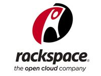
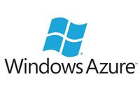
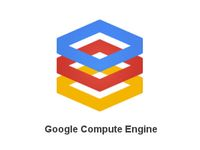

#IaaS cloud szolgáltatók
javaslat: ide jöhetne 1-2 mondat arról hogz sokféle ilyen van és attól függően választjuk ki, hogy mire akarjuk használni...
##Amazon Web Services

Az Amazon Web Services teljes körű számítási és adattárolási szolgáltatást nyújt, olyan alapvető szolgáltatásoktól kezdve, mint az EC2 instance-ok, egészen az olyan speciális szolgáltatásokig, mint például az Amazon Elastic Map Reduce (EMR) vagy a Cluster GPU instance-ok. Háttértárolás terén Elastic Block Storage (EBS) és a Simple Storage Service (S3) áll rendelkezésre. Ezen kívül vannak még különböző IaaS-hoz kapcsolódó szolgáltatásai is, mint például munkafolyamatok, üzenet küldés, archiválás, kereső szolgáltatás, relációs és NoSQL adatbázisok és még sok minden más. Szolgáltatások számát tekintve az Amazon vezető szerepet tölt be.

##Rackspace Open Cloud

Rackspace egy alapvető felhő szolgáltatást nyújt, nagy figyelmet fordítva az ügyfélközpontúságra. Rackspace az egyik alapítója az OpenStack-nek, melyet a felhő infrastruktúrájánál is használ. Így később, ha saját privát vagy hibrid felhőt szeretnénk használni, nem kell a fejlesztést előrről kezdeni, mivel az infrastruktúránk könnyen átvihető.

##DigitalOcean

A DigitalOcean VPS (virtuális dedikált szerver) szolgáltatóból nötte ki magát, így mostanra egyre több szolgáltatást nyújt a dedikált szervereken kívül. Előnye a többi szolgáltatóhoz képes abban rejlik, hogy viszonylag egyszerű és jól átlátható a szolgáltatásai vannak, ezért kicsi a belépési küszöb. Ezen túl a a szolgáltatók között az egyik legjobb ügyfélszolgálata.

##Windows Azure

A névvel ellentétbe a Windows Azure nem csak a Windows operációs renszer futtatását teszi lehetővé. A számítási és tárolási szolgáltatásit tekintve minden megtalálható nála amit egy IaaS szolgátatótól elvárhatunk. A rendszergazdák a Windows Azure-ral való munkát sokkal könnyebnek fogják találni, köszönhetően a remek felhaszálói felületének. A szolgáltatásai kínálatában megtalálható többek között a virtuális gépek, üzenet küldés, relációs és NoSQL adatbázisok.

##Google Compute Engine

A Google Compute Engine jól illeszkedik big data, adattárház, és egyébb analítikához kapcsolódó alkalmazásokhoz Jól integrálódik a többi Google szolgáltatással, mint a Google Cloud Storage, a Google BigQeury és a Google Cloud SQL. Bár a Google Compute Engine egy relatív új szolgáltatás az IaaS piacon, a tény, hogy a Google globális infrastruktúráján fut, beleértve a privát optikai hálózatát és magas hatékonyságú adatközpontjait, emeli ki a többi közül.
